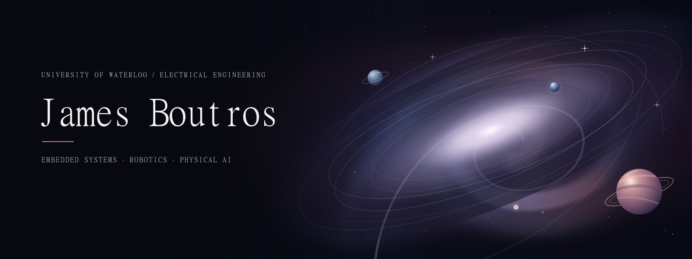

  

  <a href="https://jamesboutrosweb.vercel.app">Portfolio</a>
  &nbsp;·&nbsp;
  <a href="https://www.linkedin.com/in/james-b-2682403b3/">LinkedIn</a>
  &nbsp;·&nbsp;
  <a href="mailto:jboutros@uwaterloo.ca">Email</a>

Electrical Engineering student at the University of Waterloo building across **embedded hardware, robotics, and intelligent software**—from custom PCBs and hardware bring-up to ROS 2 systems and local-first AI.

## Current work

- **Phydata** — Co-founder and CTO of a physical-AI data infrastructure startup. I designed the MVP blueprint and hardware concepts; the company secured **$20K in early investment**.
- **WARG** — Designing and bringing up custom PCBs for autonomous aerial vehicles.
- **WATonomous** — Working on electrical integration for a humanoid robot, including wiring, sensors, actuators, and ROS 2 interfaces.
- **Applied ML research** — Studying whether explanation drift can help detect model errors under real-world distribution shift.

## Selected work

- **[Astrono Jarvis](https://github.com/jcb1515/Jarvis)** — A local-first, voice-controlled AI assistant combining Qwen through Ollama, Whisper, a real-time 3D interface, and confirmation-gated tools.
- **[Burn Shield](https://github.com/jcb1515/Ignition-Hacks)** — A hackathon-built startup-spend auditor that explains suspicious vendor costs, forecasts scenarios, and pauses for human approval.
- **[Embedded systems & robotics](https://jamesboutrosweb.vercel.app)** — Custom PCB design, a self-righting robot, a four-microcontroller flight-control simulation, and Arduino sensor/control systems.
- **[Model reliability research](https://jamesboutrosweb.vercel.app)** — Evaluating Logistic Regression, XGBoost, and TabPFN on hospital-readmission and U.S. Census housing datasets.
- **[MicroLoop](https://jamesboutrosweb.vercel.app)** — An end-to-end SwiftUI productivity app built during the Career Education Council / Apple co-op and presented to Apple engineers.

## Technical focus

- **Hardware & embedded:** C++, Python, Altium Designer, ESP32, Arduino, PCB layout, soldering, hardware bring-up
- **Robotics & systems:** ROS 2, MuJoCo, Isaac Sim, sensor/actuator integration, state machines, distributed control
- **AI & software:** local inference, Whisper, MCP, Python, TypeScript, React, SwiftUI

**2× hackathon winner** · [Portfolio](https://jamesboutrosweb.vercel.app)
